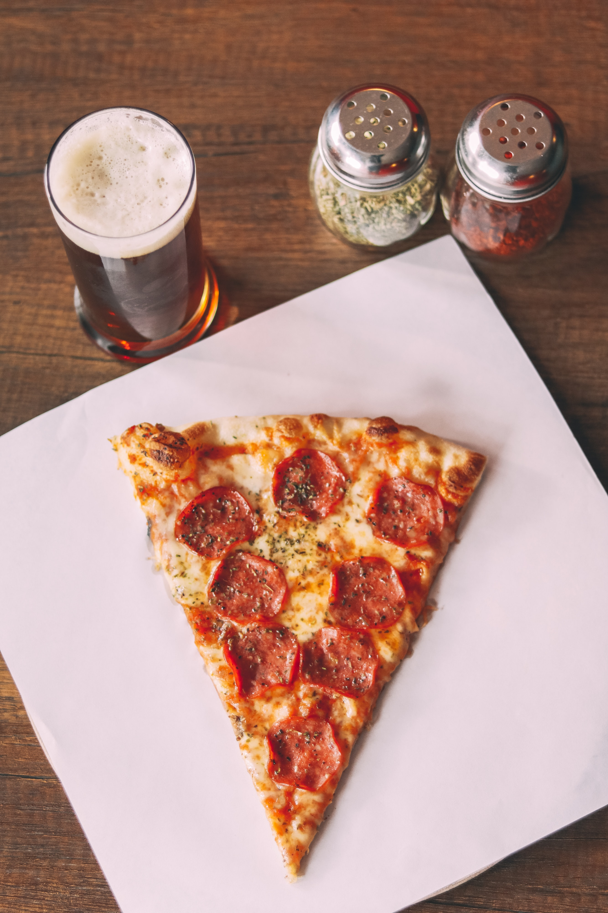

# MENU

## Pizze klasyczne

|lp |Pizza                                                   | rozmiar| 30cm | 40 cm | 50 cm|
|---|--------------------------------------------------------|--------|------|-------|------|
|1. |MARGHERITA - sos, ser, oregano.                         |        | 30zł | 31 zł | 32zł |
|2. |CAPRICIOSA - sos, ser, pieczarki, szynka, oregano.      |        | 32 zł| 33 zł | 34 zł|
|3. |SALAMI - sos, salami, ser, oregano.                     |        | 33 zł| 34 zł | 35 zł|
|4.  |HAWAJSKA - sos, ser, ananas, szynka.                    |        | 34 zł| 35 zł | 36 zł|
|5. |MILANO  - sos, podwójny ser, salami jalapeno, papryka.  |        | 35 zł| 36 zł | 37 zł|
|6.  |WIEJSKA  - sos, ser, ogórek, papryka, szynka,           |        | 35 zł| 36 zł | 37 zł|
|7.  |POLLO  - sos, podwójny ser, salami, kurczak.            |        | 36 zł| 37 zł | 38 zł|
|8.  |KEBAB  - sos, podwójny ser, salami, kurczak, cebula.    |        | 36 zł| 37 zł | 38 zł|
|9.  |EL TONO  - sos, podwójny ser, tuńczyk,  papryka.        |        | 37 zł| 38 zł | 39 zł|
|10. |DAGRASSO  - sos, ser, salami, papryka, rukola, oliwki, |        | 37 zł| 38 zł | 39 zł|

## Pizze wegetariańskie 

|lp |Pizza                                                     | rozmiar| 30cm | 40 cm | 50 cm|
|---|----------------------------------------------------------|--------|------|-------|------|
|1. |MARGHERITA - sos, ser, oregano.                           |        | 30zł | 31 zł | 32zł |
|2. |CAPRICIOSA - sos, ser, pieczarki, szynka, oregano.        |        | 32 zł| 33 zł | 34 zł|
|3. |4SERY - sos, mozarella, gorgonzola, parmezan, ementaler   |        | 33 zł| 34 zł | 35 zł|
|4. |HAWAJSKA WEGE - sos, ser, ananas,                         |        | 34 zł| 35 zł | 36 zł|
|5. |MILANO WEGE  - sos, podwójny ser, papryka.                |        | 35 zł| 36 zł | 37 zł|
|6. |ŁOSOŚ - sos, podwójny ser, łosoś, cukinia.                |        | 38 zł| 39 zł | 40 zł|
|7. |GÓRALSKA - sos, podwójny ser, oscypek, żurawina.          |        | 38 zł| 39 zł | 40 zł|
|8. |WŁOSKA  - sos, podwójny ser, pomidorki koktajlowe, rukola |        | 39 zł| 40 zł | 42 zł|
|9. |FLORENCKA  - sos, ser feta, szpinak                       |        | 39 zł| 40 zł | 42 zł|
|10. |HAWAJSKA - sos, ser, camembert, ananas, brokuł           |        | 39 zł| 40 zł | 42 zł|

## Sałatki 

|lp |Nazwa                                                   | cena  | 
|---|--------------------------------------------------------|------|
|1. |CEZAR - sałata, oliwa, pomidor, cebula, mozarella      | 22 zł |
|2. |GRECKA - pomidor, ogórki, papryka, sałata, feta         | 23 zł | 
|3. |RUKOLOWA - rukola, pomidor, orzechy włoskie, feta       | 22 zł | 
|4. |TUŃCZYKOWA - sałata, tuńczyk, ogórek, kukurydza         | 22 zł | 

## Sosy 

|lp |Nazwa                                                   | waga   | 50g  | 100g |
|---|--------------------------------------------------------|--------|------|-------|
|1. | KETCHUP                                                |        | 5 zł | 6 zł  | 
|2. |CZOSNKOWY                                               |        | 5 zł | 6 zł  | 
|3. |SŁODKO KWAŚNY                                           |        | 7 zł | 8 zł  | 
|4. |KOPERKOWY                                               |        | 7 zł | 8 zł  | 
|5. |OSTRY                                                   |        | 7 zł | 8 zł  | 

## Dodatki

cukinia - 5zł

karczochy - 6 zł

krewetki - 10 zł

rukola - 4 zł

kukurydza - 4 zł

pieczarki - 5 zł

## Napoje 

|lp |Napoje                                                   | pojemność| 0,25l | 0,5l cm | 
|---|---------------------------------------------------------|----------|-------|---------|
|1. |COCA COLA                                                |          | 6 zł  | 10 zł   | 
|2. |PEPSI                                                    |          | 6 zł  | 10 zł   | 
|3. |LEMONIADA                                                |          | 12 zł | 18 zł   | 
|4. |SOK WYCISKANY                                            |          | 14 zł | 20 zł   | 
|5. |WODA NIEGAZOWANA                                         |          | 4 zł  | 8 zł    |
|6. |WODA GAZOWANA                                            |          | 4 zŁ  | 8 zł    | 
|7. |HERBATA                                                  |          | 8 zł  | 12 zł   | 
|8. |KAWA                                                     |          | 10 zł | 14 zł   | 
|9. |GORĄCA CZEKOLADA                                         |          | 12 zł | 18 zł   | 
 
